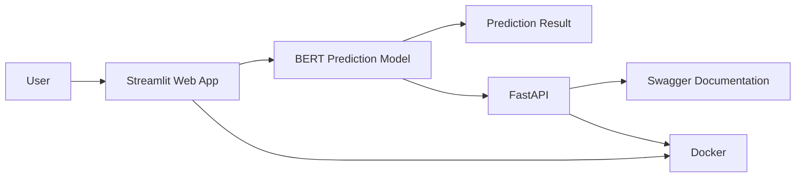
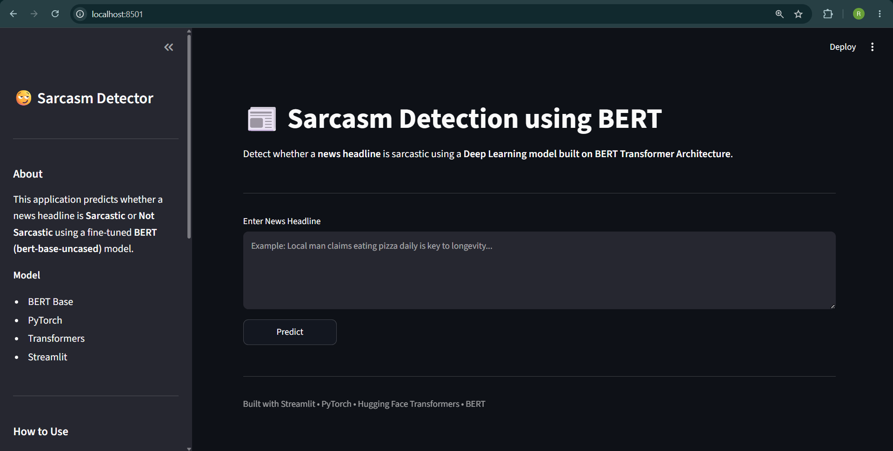
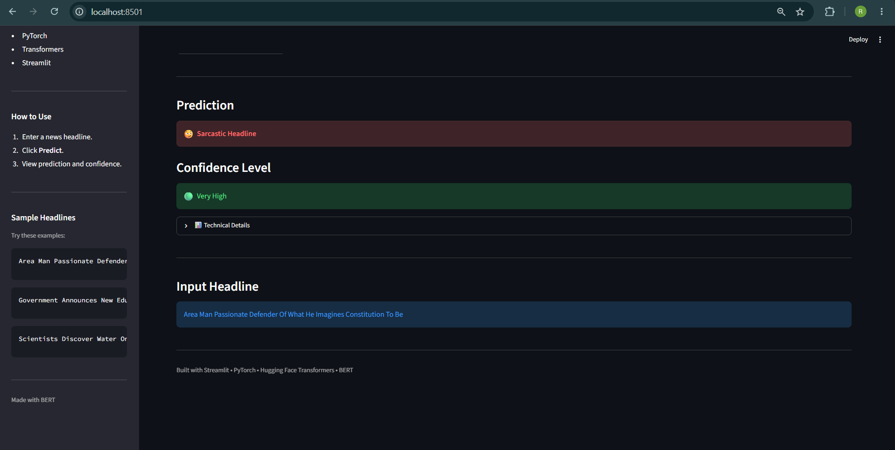
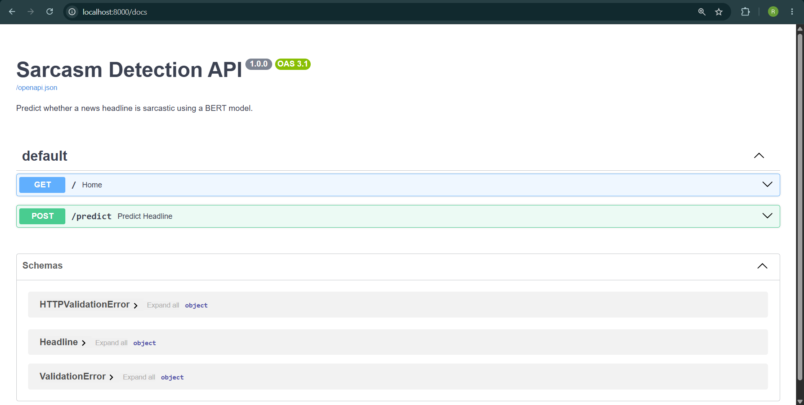
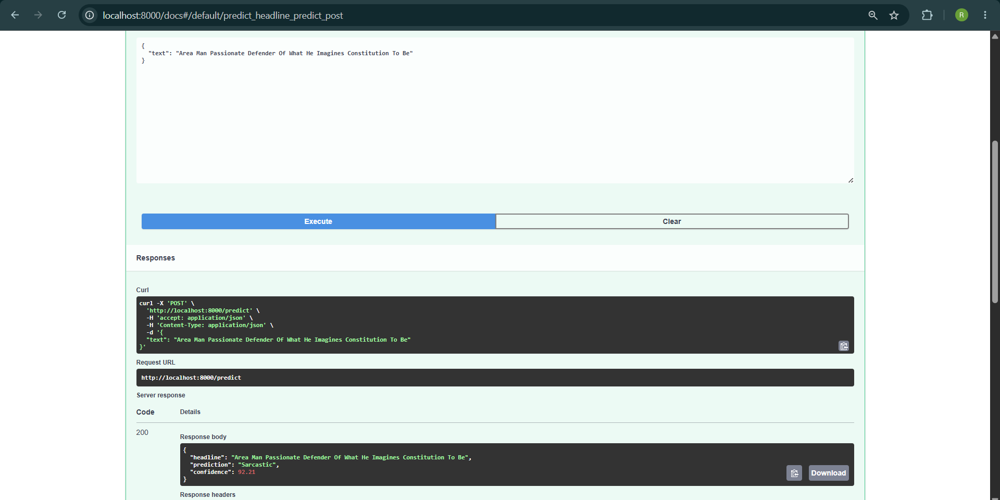

# 😏 Sarcasm Detection using BERT


---

## 📌 Project Overview

The project includes an interactive Streamlit web application deployed on Streamlit Community Cloud, a FastAPI REST API with Swagger documentation, and Docker support for containerized execution.

The application provides:

- 🖥️ Interactive Streamlit Web Application
- 🚀 FastAPI REST API
- 📖 Swagger API Documentation
- 🐳 Docker & Docker Compose Support
- 📊 Prediction Confidence Levels
- 🤖 Deep Learning based inference using BERT

---

# 🔗 Project Links

- **GitHub Repository:** https://github.com/Rishit925/Bert-Sarcasm-Detector
- **Hugging Face Model:** https://huggingface.co/Rishit925/Bert-Sarcasm-Detector
- **Live Demo:** https://bert-sarcasm-detector-2pfyxhjwb9dxg3thwwrtss.streamlit.app/

# 🏗 Project Architecture



---

# ✨ Features

- Fine-tuned BERT model for sarcasm detection
- Streamlit based user interface
- FastAPI REST API
- Automatic Swagger Documentation
- Dockerized application
- Docker Compose support
- Confidence level visualization
- Clean project structure

---

# 🖼 Screenshots

## Home Page



---

## Prediction



---

## FastAPI Swagger





---

# 🛠 Tech Stack

### Programming Language

- Python

### Deep Learning

- PyTorch
- Hugging Face Transformers

### API

- FastAPI
- Pydantic

### Frontend

- Streamlit

### Deployment

- Docker
- Docker Compose

---

# 📂 Project Structure

```text
Sarcasm-Detection/

│── app.py
│── api.py
│── model.py
│── Dockerfile
│── docker-compose.yml
│── requirements.txt
│── README.md
│── .gitignore

│── tokenizer/

│── assets/

│     ├── home.png
│     ├── prediction.png
│     ├── swagger-ui-1.png
│     └── swagger-ui-2.png

│── notebooks/
│     └── text_classification.ipynb
```

---

# ⚙ Installation

Clone the repository

```bash
git clone https://github.com/Rishit925/Bert-Sarcasm-Detector.git
```

Move inside the folder

```bash
cd Bert-Sarcasm-Detector
```

Create virtual environment

```bash
python -m venv venv
```

Activate

Windows

```bash
venv\Scripts\activate
```

Install dependencies

```bash
pip install -r requirements.txt
```

> **Note**
>
> The trained BERT model (~439 MB) is hosted on Hugging Face Hub and is automatically downloaded when the application starts. This keeps the GitHub repository lightweight while enabling seamless deployment on Streamlit Community Cloud.

---

# 🚀 Running the Streamlit App

```bash
streamlit run app.py
```

Application:

```
http://localhost:8501
```

---

# 🔌 Running the FastAPI Server

```bash
uvicorn api:app --reload
```

Swagger UI

```
http://localhost:8000/docs
```

---

# 🐳 Docker

Build

```bash
docker build -t sarcasm-detector .
```

Run

```bash
docker run -p 8501:8501 sarcasm-detector
```

---

# 🐳 Docker Compose

Start

```bash
docker compose up --build
```

Stop

```bash
docker compose down
```

---

# 📌 Deployment Status

The application has been successfully deployed and tested on Streamlit Community Cloud.

### Deployment Details

- ✅ Streamlit Community Cloud
- ✅ Hugging Face Hub for model hosting
- ✅ Automatic model download during application startup
- ✅ FastAPI support
- ✅ Docker & Docker Compose support

# 📡 API Endpoint

### POST

```
/predict
```

Request

```json
{
  "text":"Scientists Discover Water On Mars"
}
```

Response

```json
{
  "headline":"Scientists Discover Water On Mars",
  "prediction":"Not Sarcastic",
  "confidence":92.21
}
```

---

# 🧠 Model Details

| Parameter | Value |
|-----------|-------|
| Model | BERT Base Uncased |
| Framework | PyTorch |
| Tokenizer | BertTokenizer |
| Task | Binary Text Classification |
| Output | Sarcastic / Not Sarcastic |

---

# 📈 Future Improvements

- Improve model accuracy through hyperparameter tuning.
- Train on a larger and more diverse sarcasm dataset.
- Experiment with RoBERTa, DistilBERT, and DeBERTa.
- Add batch prediction support.
- Deploy the FastAPI backend to a cloud platform such as Render or Railway.
- Improve inference speed through model optimization.

---

# 👨‍💻 Author

**Rishit Mahindru**

---

